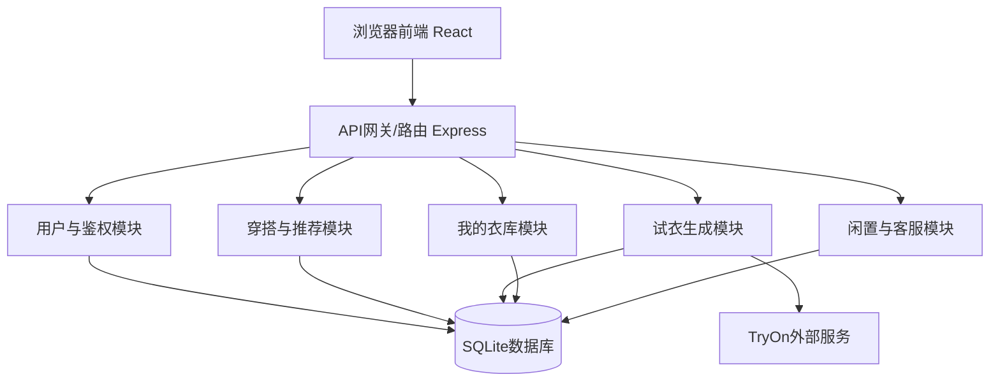

# Zchoose-AI穿搭助手 设计开发文档（B/S架构）

> 参赛类型：B/S 架构 Web 应用  
> 项目名称：Zchoose-AI 穿搭助手  
> 版本：V1.0（比赛提交版）

---

## 1. 需求分析

### 1.1 开发目的

本项目面向“日常穿搭决策困难 + 线上试衣体验不足”的用户痛点，提供一个基于 **B/S 架构** 的一站式穿搭平台。用户通过浏览器即可完成注册登录、衣库浏览、试衣生成、我的衣库上传、闲置发布等操作，降低穿搭决策成本，提高服装试错效率。

### 1.2 目标用户

- 普通用户：希望快速获得穿搭建议并在本人形象上预览效果；
- 内容运营/商家：希望发布搭配、配置商家槽位并提升转化；
- 校园/轻量创业团队：需要低部署门槛、可快速迭代的 Web 方案。

### 1.3 功能需求

- 用户与权限：注册登录、JWT 鉴权、个人资料；
- 穿搭推荐：按性别/场合/年龄段筛选；
- 虚拟试衣：上传人像、选择搭配、生成试衣结果；
- 我的衣库：用户上传服装图并参与试衣；
- 积分与解锁：搭配解锁、基础激励能力；
- 闲置与客服：闲置发布浏览、反馈支持。

### 1.4 性能与非功能需求

- 响应性：列表/筛选操作流畅，试衣过程有状态反馈；
- 安全性：鉴权校验、越权防护、受控图片访问；
- 可扩展性：前后端分离，路由按领域拆分；
- 易部署性：支持本地开发与公网部署，配置可环境变量化。

### 1.5 竞品分析表

| 维度 | 小红书穿搭内容 | 电商试衣功能 | 本项目（Zchoose） |
|---|---|---|---|
| 核心能力 | 内容种草 | 商品导购+局部试穿 | 推荐+我的衣库+试衣+闲置闭环 |
| 个性化程度 | 中（靠关注） | 中（偏商品） | 高（本人图 + 自有衣物） |
| 可解释性 | 中 | 低~中 | 高（标签化筛选） |
| 使用门槛 | 低 | 低 | 低（浏览器即用） |
| 项目创新点 | 社区内容强 | 交易链路强 | 轻量 B/S 架构下实现试衣闭环 |

---

## 2. 概要设计（图文结合）

### 2.1 总体架构说明（B/S）

系统采用浏览器/服务器（B/S）架构：

- 表现层：React + Vite 前端；
- 业务层：Node.js + Express API；
- 数据层：SQLite（sql.js）；
- 外部服务：TryOn 服务（FASHN）。

### 2.2 模块结构图（可直接放文档）

### 2.3 调用关系与接口

- 前端通过 `fetch /api/*` 调用后端 REST 接口；
- 试衣主接口：`POST /api/try-on/generate`；
- 我的衣库：`POST /api/wardrobe`、`GET /api/wardrobe/my`；
- 上传能力：`POST /api/upload/photo`。

### 2.4 人机界面概述

- 试衣页面支持：上传人像、选择官方衣库/我的衣库、放大预览后确认选择、生成结果查看下载；
- 列表与按钮风格统一，移动端适配良好。

---

## 3. 详细设计

### 3.1 界面设计（附流程）

建议在最终 PDF 中放 4 张截图：

- 图3-1：试衣页（上传+筛选+衣物列表）
- 图3-2：点击缩略图后放大预览弹层（确定/返回）
- 图3-3：试衣结果页（结果图+下载）
- 图3-4：我的衣库页（上传与列表）

**典型使用流程：**

1. 用户登录并上传人像；  
2. 在官方衣库或我的衣库中点击某套衣物；  
3. 弹出大图预览，点击“确定”完成选择；  
4. 点击“生成”，系统返回试衣结果；  
5. 用户查看并下载结果图。

### 3.2 数据库设计

核心表（示意）：

| 表名 | 关键字段 | 说明 |
|---|---|---|
| users | id, phone, password_hash | 用户信息与登录 |
| outfits | id, name, image_url, tags | 官方衣库搭配 |
| wardrobe_items | id, user_id, name, image_url | 我的衣库 |
| tryon_results | id, user_id, result_url, created_at | 试衣记录 |
| points_records | id, user_id, points, type | 积分流水 |

说明：当前设计符合基本范式要求；若个别业务字段反范式（如冗余标签文本）用于查询性能优化，需要在后续版本补充说明。

### 3.3 关键技术与创新点

- 前后端分离：前端独立渲染，后端提供 REST API；
- 试衣链路优化：支持官方衣库与我的衣库双源输入；
- 交互优化：缩略图点击放大后“确定/返回”，减少误选；
- 安全设计：JWT 鉴权、越权校验、受控图片访问；
- 可维护性：模块化路由与配置化部署。

---

## 4. 测试报告

### 4.1 测试用例与过程

已执行黑盒+白盒测试，覆盖注册、上传、衣库、试衣、越权校验等关键路径。  
主要接口测试：`/api/users/register`、`/api/upload/photo`、`/api/wardrobe`、`/api/try-on/generate`。

### 4.2 测试结果与修正

- 主流程可通过：上传 -> 选衣 -> 试衣生成；
- 安全分支有效：无效 token、越权访问、参数缺失均被正确拦截；
- 修正情况：已修复“我的衣库图片访问链路”问题，避免非受控路径导致的拉图失败。

### 4.3 技术指标简述

- 运行速度：常规页面请求响应快，试衣耗时受上游服务影响；
- 安全性：具备登录鉴权、访问控制、参数校验；
- 扩展性：模块化路由，便于新增业务；
- 部署方便性：支持本地与云服务器部署；
- 可用性：关键流程闭环完整，交互清晰。

---

## 5. 安装及使用说明

### 5.1 环境要求

- Node.js 18+，npm；
- Windows/Linux/macOS 均可；
- 可选：配置 TryOn 外部服务。

### 5.2 安装步骤

1. 安装后端依赖并配置 `.env`；
2. 安装前端依赖并启动；
3. 启动 `tryon-service`（如启用真实试衣）；
4. 浏览器访问前端地址进行测试。

### 5.3 典型使用流程

- 登录 -> 上传人像 -> 选择衣物（预览确认） -> 生成 -> 查看/下载结果。

---

## 6. 项目总结

本项目在有限周期内完成了从需求分析、系统设计到核心功能落地的全流程实现，重点解决了“线上穿搭决策效率低、试衣体验不直观”的问题。开发过程中主要难点在于试衣链路稳定性、图片访问控制与前后端联调。团队通过模块化开发、接口联调和黑白盒测试逐步定位并修复关键问题。  
后续可升级方向包括：更精细化的个性推荐、试衣速度优化、数据可视化运营后台和多端适配。项目具备校园场景展示价值与小规模推广潜力。

---

## 7. 参考文献

[1] Fielding R. Architectural Styles and the Design of Network-based Software Architectures[D]. UC Irvine, 2000.  
[2] React 官方文档. [https://react.dev/](https://react.dev/)  
[3] Express 官方文档. [https://expressjs.com/](https://expressjs.com/)  
[4] SQLite 官方文档. [https://www.sqlite.org/docs.html](https://www.sqlite.org/docs.html)  
[5] OWASP Top 10. [https://owasp.org/www-project-top-ten/](https://owasp.org/www-project-top-ten/)

---

## 附：排版执行说明（导出 PDF 前）

- 一级标题：二号黑体，居中；
- 二级标题：三号黑体，左对齐；
- 三级标题：按需设置；
- 正文：五号宋体；
- 图表统一编号（图2-1、表1-1等），控制篇幅简明。
