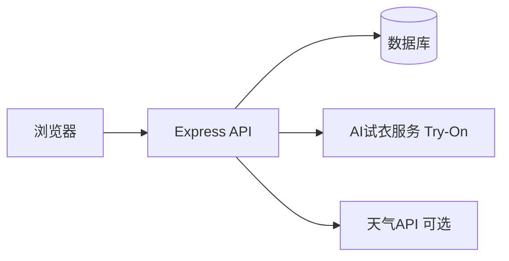

# 软件应用与开发类作品设计和开发文档

> **说明**：本文档结构与 **《3 软件应用与开发类作品设计和开发文档模板（2026版）》** 一致（第一章～第六章 + 参考文献），并按模板要求控制篇幅：**简要、二级目录为主、图文并茂以概要设计为重点**。排版要求：一级标题二号黑体居中，二级三号黑体左对齐，正文五号宋体——**导出 Word/PDF 时在本地设置**。

| 项目 | 填写内容 |
|------|----------|
| **作品编号** | （提交时由系统生成后填写） |
| **作品名称** | Zchoose 打工人场景化穿搭导航平台 |
| **版本编号** | V1.0 |
| **填写日期** | 2026 年 __ 月 __ 日 |

---

## 填写说明（摘自大赛 2026 模板）

本文档适用于软件应用与开发类各小类作品（含 Web 应用、移动应用、算法程序、工具软件、专项赛等）。文档为**简要文档**，不宜长篇大论，建议设计**二级目录**、逻辑清晰。提交 **PDF**。内容须**真实**。

**若作品涉及人工智能大模型**，须在文档各部分说明：（1）**AI 使用说明**（模型/工具名称版本、用于何环节、学生把关与结果验证方式）；（2）**关键提示词与输出样例**（5～10 条）；（3）**版权说明**（引用与素材授权）。  
—— 本项目 AI 相关说明见 **附录 A**。

---

## 目录

- [第一章 需求分析](#第一章-需求分析)
- [第二章 概要设计](#第二章-概要设计)
- [第三章 详细设计](#第三章-详细设计)
- [第四章 测试报告](#第四章-测试报告)
- [第五章 安装及使用](#第五章-安装及使用)
- [第六章 项目总结](#第六章-项目总结)
- [参考文献](#参考文献)
- [附录 A 人工智能应用说明（大赛要求）](#附录-a-人工智能应用说明大赛要求)

---

## 第一章 需求分析

**【模板要求：建议不超过 1000 字，以 300 字以内为宜；说明开发原因、竞品、用户、主要功能与性能；可有竞品分析表。】**

### 1.1 开发原因与价值

都市「打工人」在通勤、会议、约会等场景下普遍存在 **穿搭决策耗时、线上仅看模特图难以判断本人效果、试衣与购买及闲置处置分散在多类 App** 等问题。本项目 **Zchoose** 定位为 **打工人场景化穿搭导航平台**：在 **B/S Web** 上以 **「先场景、再搭配」** 组织衣库与快速推荐，并集成 **AI 虚拟试衣（用户本人为模特）**、**我的衣库**、**商家槽位**与 **闲置市场**，形成 **穿—试—导—转** 的一体化闭环，降低试错成本并契合绿色闲置理念。

### 1.2 用户与主要功能

- **用户**：18～35 岁注重形象的打工人；商家运营者；有闲置流转需求的用户。  
- **主要功能**：注册登录与个保合规同意；**首页天气与推荐**（衣库存量超阈值时优先展示「我的衣库」）；**场景化衣库筛选**与 **快速穿搭**；**AI 试衣**（官方衣库 / 我的衣库）；积分解锁与会员说明；**商家槽位**；**闲置发布与浏览**；客服与投稿审核；衣库标签 **人工校正**（管理端）。  
- **主要性能**：常规列表与筛选响应在本地与局域网演示环境下流畅；试衣耗时受 **外部 Try-On 服务** 与网络影响，系统具备 **降级占位** 能力以保证演示不中断。

### 1.3 竞品分析（简要）

| 维度 | 内容社区（如小红书） | 电商平台试衣 | 本项目 |
|------|---------------------|--------------|--------|
| 核心 | 种草 | 导购+单品 | **场景导航 + 本人试衣 + 闲置闭环** |
| 决策方式 | 浏览信息流 | 搜商品 | **按场合/季节/人群标签 + 成套方案** |
| 试衣 | 模特图为主 | 部分 AR/试穿 | **第三方 AI 试衣 API，以用户为模特** |
| 闭环 | 弱 | 交易强 | **试衣—槽位—闲置同站** |

---

## 第二章 概要设计

**【模板要求：功能模块分解、层次结构、调用关系、模块接口、人机界面；建议用图，图文合计不超过 A4 两页，以 1 页为宜。】**

### 2.1 总体架构

采用 **浏览器 + Node.js API + 数据库** 的 B/S 结构；**前后端分离**：React（Vite）前端通过 HTTP 调用 Express REST 接口；数据层默认 **SQLite（sql.js）**；**虚拟试衣** 与 **天气** 以可配置 **HTTP API** 方式对接外部服务。

### 2.2 功能模块与层次

| 层次 | 模块 | 说明 |
|------|------|------|
| 表现层 | 前端 SPA | 路由页面：首页、衣库、推荐、试衣、闲置、我的等 |
| 业务层 | Express 路由 | 用户、推荐、衣库、试衣、上传、衣库、闲置、支付、管理等 |
| 数据层 | SQLite / 可选 MySQL | 用户、搭配、试衣记录、衣库项、闲置等表 |
| 外部服务 | Try-On、天气 | 试衣生成、可选实时天气 |

### 2.3 模块关系图（导出 PDF 时可截图为「图 2-1」）

### 2.4 主要接口与调用关系（摘要）

前端统一访问 `/api/*`；试衣关键路径为 `POST /api/try-on/generate`；推荐为 `GET /api/recommend`；上传为 `POST /api/upload/photo`。详见第三章。

### 2.5 人机界面概述

底部导航 + 列表卡片；试衣页包含 **上传人像—选衣—大图确认—生成—结果/下载**；关键界面建议截取 **首页、衣库筛选、试衣、试衣结果、我的衣库** 五张图放入 PDF。

---

## 第三章 详细设计

**【模板要求：界面设计（实际界面、典型流程）、数据库（表格/ER/UML）、关键算法或关键技术/创新；突出重点，忌大段铺陈。】**

### 3.1 界面与典型流程

**典型流程**：登录 → 完善偏好（可选）→ 衣库或快速穿搭选场景 → 试衣页上传人像 → 选官方搭配或我的衣库 → 预览确认 → 生成 → 查看结果。  
**交互要点**：试衣选衣 **先缩略图、再弹层确认**，减少误触；注册/登录环节完成 **隐私政策** 与 **试衣个人信息处理规则** 勾选。

### 3.2 数据库设计（核心表节选）

| 表名 | 主要字段 | 用途 |
|------|----------|------|
| `users` | id, phone, 偏好等 | 用户与登录 |
| `outfits` | id, name, image_url, style_tags | 官方衣库 |
| `user_wardrobe_items` | user_id, image_url | 我的衣库 |
| `tryon_results` | user_id, outfit_id, front_url 等 | 试衣结果 |

（**ER 图**：用户—试衣结果—搭配为关联核心；导出时可画 3～5 张主表关系。）若存在标签冗余存储，目的为 **按标签快速筛选**，属可说明的反范式取舍。

### 3.3 关键技术与创新点

1. **以用户为模特的 AI 试衣**：后端转发至 **外部 Try-On HTTP 服务**，返回试衣图；未配置或异常时 **占位图降级**。  
2. **场景化导航**：衣库与推荐按 **场合、季节、性别、年龄段** 等 **显式标签** 组织，推荐可结合 **天气加权** 与 **可解释说明字段**。  
3. **穿—买—转**：试衣结果页与 **商家槽位**、**闲置市场** 同平台串联。  
4. **安全**：JWT 鉴权；上传资源 **受控访问**；管理端 **登录 + ADMIN_SECRET** 双因素。

---

## 第四章 测试报告

**【模板要求：测试用例、过程、结果、修正；技术指标：速度、安全、扩展性、部署、可用性等，简要。】**

### 4.1 测试概况

采用 **黑盒**（完整业务路径）与 **白盒**（鉴权、越权、非法参数）相结合；覆盖注册、上传、我的衣库、试衣生成等接口。记录见项目内 `docs/第一次黑白盒测试-测试方法与执行记录.md`。

### 4.2 结果摘要

主流程接口可通；非法 token、越权、非受控图片路径等分支返回符合设计的错误码；试衣依赖上游服务时若出现 **502**，系统 **降级占位**，不阻塞其它功能演示。

### 4.3 技术指标（自评）

| 指标 | 说明 |
|------|------|
| 运行速度 | 列表与常规 API 本地响应快；试衣依赖外网与服务端 |
| 安全性 | JWT、资源归属校验、管理端双因素 |
| 扩展性 | 前后端分离、外部服务可替换 |
| 部署方便性 | Node 单进程 + 静态资源；可 Nginx 反代 |
| 可用性 | 主流程闭环完整；试衣有降级 |

---

## 第五章 安装及使用

**【模板要求：环境要求、安装过程、默认安装与典型使用流程，简要。】**

### 5.1 环境要求

- Node.js **18+**，npm；Windows / macOS / Linux。  
- 可选：独立部署 **Try-On 服务**，并在后端 `.env` 配置 `TRYON_API_URL`。

### 5.2 安装步骤（默认）

1. `backend`：`npm install`，复制 `.env.example` 为 `.env`，配置 `JWT_SECRET`、`DATABASE_PATH` 等。  
2. `frontend`：`npm install`，`npm run dev`。  
3. 浏览器访问开发服务器地址（默认 `http://localhost:5173`）。

### 5.3 典型使用流程

登录 → 衣库/推荐选场景 → 试衣上传与选衣 → 生成查看 →（可选）浏览商家槽位或发布闲置。

---

## 第六章 项目总结

**【模板要求：感悟与后续升级；建议不超过 A4 一页。】**

本项目在「打工人场景化穿搭」定位下完成 **需求—设计—实现—测试** 闭环，综合运用了 **PEST/5W1H** 需求方法、**模块化与分层架构**、**REST 接口联调** 与 **黑白盒测试**。难点在于 **试衣外部依赖** 与 **图片访问安全**，通过 **超时降级、受控 URL、鉴权** 逐项化解。后续可在 **移动端、家庭衣橱、商家尺码深度对接、推荐算法升级** 等方向演进；闲置与会员规则可持续产品化。

---

## 参考文献

**【说明】** 参赛与本科论文通常**以中文专著、期刊、标准、法规为主**；若引用外文文献，按 **GB/T 7714—2015** 著录即可（题名可保留外文），并非「只能英文」。下面给出**中文文献示例**（请按你学校格式微调；带「待补」的请换成你文献综述里真实引用的篇目）。

[1] 全国人民代表大会常务委员会. 中华人民共和国个人信息保护法[S]. 北京: 中国法制出版社, 2021.  
[2] 张海藩, 牟永敏. 软件工程导论[M]. 6 版. 北京: 清华大学出版社, 2019.  
[3] 王珊, 萨师煊. 数据库系统概论[M]. 5 版. 北京: 高等教育出版社, 2014.  
[4] 谢希仁. 计算机网络[M]. 8 版. 北京: 电子工业出版社, 2021.  
[5] 全国信息与文献标准化技术委员会. 信息与文献 参考文献著录规则: GB/T 7714—2015[S]. 北京: 中国标准出版社, 2015.  
[6] 中国大学生计算机设计大赛组委会. 中国大学生计算机设计大赛参赛指南（2026）[Z]. （以当年官网发布为准）  
[7] 李某某, 王某某. 虚拟试衣或服装推荐相关研究综述[J]. 计算机工程与应用, 20__, __(__): ___-___. （**待补**：替换为你实际阅读的**中文核心期刊/学报**论文）  
[8] 陈某. 基于 B/S 架构的 Web 应用开发实践[M]. 某某出版社, 20__. （**可选，待补**）

---

## 附录 A 人工智能应用说明（大赛要求）

### A.1 AI 使用说明

| 项目 | 内容 |
|------|------|
| **使用的外部能力** | **虚拟试衣图像生成**：通过后端配置的 **Try-On HTTP 接口**（环境变量 `TRYON_API_URL`，具体实现可为自研 **tryon-service** 或对接 **FASHN 等** 提供的试衣生成能力；**名称、版本、部署日期**以参赛现场演示环境为准）。 |
| **可选** | **天气数据**：用于推荐展示与加权时可调用 **Open-Meteo** 或 **和风天气** 等接口（以 `.env` 配置为准）。 |
| **本作品中的环节** | **试衣效果图生成**（图像生成类能力）；**非**用大模型直接生成全部业务代码。 |
| **学生把关与验证** | 试衣结果进行 **人工目视检查** 与 **多轮联调**；接口层对超时与错误做 **降级占位**；**黑盒/白盒测试** 验证主链路与安全分支；不真实宣称医学或身材诊断效果。 |

### A.2 关键提示词与输出样例（若试衣服务内部使用大模型）

> 若实际部署的 tryon-service **未使用**对话式大模型，可注明「试衣为专用生成接口，无多轮提示词」，本附录可仅保留 A.1。

（示例，按实际填写或删除）  
1. 提示词：将用户图与服装图对齐生成试穿效果 → 输出：试衣结果图 URL。  
2. …（至多列举 5～10 条决定性操作或参数配置说明）

### A.3 版权说明

- 衣库展示图、UI 素材：使用 **自有拍摄或已获授权** 素材；用户上传内容版权归用户，平台仅用于约定功能。  
- 第三方试衣/天气 API：遵守各服务商用户协议；演示文档中可附服务名称列表。  
- 若使用 AI 辅助 **文档润色或代码编辑**，应在答辩材料中诚实说明工具类型（如编辑器辅助），**核心设计与实验为学生主导**。

---

*将本文档内容粘贴至大赛 Word 模板后，按模板设置字体与页边距，导出 PDF 提交。*
