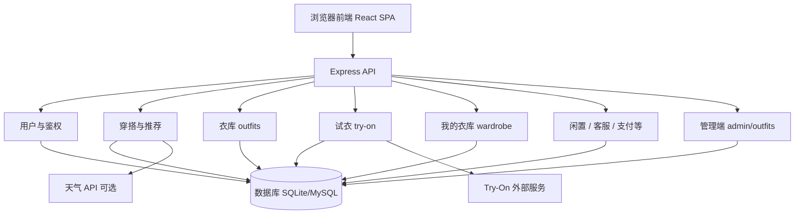

# Zchoose 打工人场景化穿搭导航平台 — 设计开发文档（完整版）

> **文档性质**：合并软件设计说明书、B/S 架构参赛说明、测试记录摘要、试衣与运营迭代要点的一版**总文档**，便于论文/答辩/比赛提交时**一次导出**或按章节拆分。  
> **与参赛材料关系**：项目对外定位、亮点表述与《Zchoose打工人场景化穿搭导航平台项目介绍》PPT **一致**；本文档补充实现细节与接口/数据表级说明。  
> **与代码关系**：以仓库 `d:\cursor` 当前实现为主；若与某分支不一致，以对应版本源代码为准。  
> **文档版本**：2.1（完整版 · 对齐参赛 PPT 口径）  
> **建议完成日期**：2026 年（请按实际修改）

---

## 文档使用说明

| 用途 | 建议操作 |
|------|----------|
| **论文正文** | 可拆为：绪论/需求/概要设计/详细设计/测试/总结；本章结构已按常见工科论文顺序编排。 |
| **比赛或软著** | 可直接使用「需求分析—概要设计—详细设计—测试—安装说明—总结」连续章节；插图自 `docs/images/` 引用。 |
| **文献交叉引用** | 「第 1.5 节 相关工作」与「参考文献」预留条目；将你桌面文献按学校格式填入即可。 |
| **图表** | 「第 11 章 图表与插图规范」给出**全文章节—图号—内容要点**；导出 Word 时插入对应截图或导出 Mermaid 为 PNG。 |

---

## 封面信息

| 项目 | 内容 |
|------|------|
| **文档名称** | Zchoose 打工人场景化穿搭导航平台 — 设计开发文档（完整版） |
| **软件名称** | **Zchoose**（对外表述：打工人场景化穿搭导航平台；技术文档中亦沿用仓库名「Zchoose-AI 穿搭助手」） |
| **软件版本** | 前端 `0.1.0` / 后端 `0.1.0`（以 `package.json` 为准） |
| **架构类型** | B/S（浏览器 / 服务器） |
| **作者** | （填写姓名或团队） |
| **完成日期** | 2026 年 __ 月 __ 日 |

**著作权声明（可删减）**

本软件及其文档的著作权由权利人依法享有。未经权利人书面许可，任何单位和个人不得对软件进行反向工程、复制、传播或用于超出授权范围的商用行为。用户依据许可协议或法律法规使用本软件的除外。

---

## 目录（建议）

1. [绪论](#1-绪论)（含场景化定位与三大创新点）  
2. [需求分析](#2-需求分析)  
3. [概要设计](#3-概要设计)  
4. [详细设计](#4-详细设计)  
5. [安全设计与个人信息保护](#5-安全设计与个人信息保护)  
6. [测试与质量保障](#6-测试与质量保障)  
7. [部署与运维](#7-部署与运维)  
8. [项目管理与迭代规划](#8-项目管理与迭代规划)  
9. [项目总结](#9-项目总结)  
10. [参考文献](#10-参考文献)  
11. [图表与插图规范（全文章节对照）](#11-图表与插图规范全文章节对照)  
12. [附录](#12-附录)  

---

## 1 绪论

### 1.1 项目背景与问题陈述（场景化导航视角）

**目标人群（Who）**：主要面向 **18～35 岁、具有一定文化素养且注重外在形象的「打工人」**（通勤白领、职场新人、追求性价比用户等）。典型时刻（When）为：**早上出门前、换季、会议/约会/过节等特殊场合**；场景（Where）覆盖**家中衣橱前、通勤路上、办公室、出差酒店**等。

**痛点链条**：用户在「时间紧、选择多、怕穿错、买回来不合适、闲置浪费」压力下，往往陷入 **「搜索 → 浏览 → 想象 → 犹豫 → 放弃」** 的循环；现有工具存在 **想象与上身差距大、风格依赖被动搜索、试衣与购买/处置割裂** 等缺口，缺少一个 **懂场景、懂身份、能直接给方案** 的导航型产品。

**宏观与可行性（与立项分析一致）**：政策上落实《个人信息保护法》要求的**告知同意**（试衣等人像与体型数据**单独同意**）及隐私政策展示；社会层面呼应穿搭焦虑与闲置处理需求；技术上 **AI 试衣 API 可服务化接入**（如对接 FASHN 等 Try-On 服务）、**React + Node.js** 技术栈成熟；经济上小规模部署成本可控。

**本系统定位**：**Zchoose —— 打工人场景化穿搭导航平台**。它不是泛化的「穿搭社区」或单品电商，而是以 **「先选场景，再出搭配」** 为主线，将 **天气与场合、标签化衣库、本人上身试衣、商家槽位与闲置流转** 串在同一 **B/S Web** 内，形成可演示、可迭代的闭环（详见 1.2 节三大创新点）。

### 1.2 场景化定位与三大创新点（答辩与文档突出项）

以下表述与参赛《项目介绍》PPT 对齐，建议在答辩稿、摘要、引言中**原样保留或缩写使用**。

| 创新点 | 一句话 | 设计/实现要点 |
|--------|--------|----------------|
| **创新点一：以用户为模特的 AI 试衣** | 从「看模特」到「看我穿」 | 集成 **专业 AI 试衣 API**（通过 `TRYON_API_URL` 对接外部生成服务）；用户上传人像后，在**本人影像**上预览搭配，提升决策确定性；可与 Before/After（模特图 vs 本人试衣）对比展示答辩效果。 |
| **创新点二：场景化穿搭导航** | 先场景，再搭配，告别大海捞针 | **快速穿搭 / 衣库**按 **场合、季节、性别、年龄段** 等标签组织；用户先选场景（如职场通勤），系统给出少量成套方案并辅以**天气适配提示**，将决策从「刷内容」变为「按场景导航」。 |
| **创新点三：「穿 — 买 — 转」闭环** | 试衣 → 槽位导购 → 闲置流转在同一站点 | **试衣**体验与 **商家槽位**（上衣/裤子/鞋子等导购入口）及 **闲置市场**（用户闲置与过季货品）同平台串联，缓解「试衣 App、电商平台、二手平台」功能割裂；延伸衣物生命周期，契合绿色消费叙事。 |

**能力组合（需求分析口径）**：**场景导航引擎** + **AI 试衣 API** + **标签筛选系统** + **私有衣库匹配**（如「我的衣库」数量较多时首页优先推荐自有衣物）+ **闲置流转模块**；与实现模块的对应关系见第 2 章、第 4 章。

### 1.3 建设目标与意义

- **目标**：在可控工程复杂度下，实现「**场景化、可解释**的穿搭导航 + **以用户为模特**的试衣 + **自有衣物**参与试穿 + **穿买转**商业与社会价值闭环」的一体化站点。  
- **意义**：将决策逻辑显式化（标签与场合），将体验落到「本人上身」；将合规嵌入产品（单独同意、受控上传访问）；便于赛事展示与论文撰写中的**问题—方法—验证**叙述。

### 1.4 设计范围与边界

**范围内**：用户与鉴权、衣库与标签、快速穿搭推荐（含天气与阶梯兜底）、试衣流程（官方衣库 + 我的衣库）、积分与解锁、商家槽位与尺码规则（基础）、闲置市场、客服与审核、支付相关接口预留、管理端衣库标签人工校正（需登录 + 管理密钥）。

**范围外或不保证**：试衣效果达到商业级精度（强依赖上游模型与服务可用性）；全站达到大规模协同过滤推荐水平；线下物流与支付全流程（依实际对接为准）。

### 1.5 相关工作与理论依据（预留）

> **撰写说明**：此处对应论文「相关工作」或「文献综述」精简版。请将你收集的文献按 **GB/T 7714** 或学校要求的格式列入第 10 章，并在下表建立**主题—文献—本文对应模块**的映射。

| 研究主题 | 可引用方向（示例） | 本系统对应实现 |
|----------|-------------------|----------------|
| 推荐系统 | 基于内容/协同过滤/混合推荐 | 标签规则召回、可选天气加权、推荐结果可解释字段 |
| 时尚图像与属性 | 服装属性识别、多模态检索 | 衣库 `style_tags`、自动打标签与人工校正台 |
| 虚拟试衣 / Try-On | 图像生成、人体解析 | `TRYON_API_URL` 外部服务、三视图或单图结果展示 |
| Web 安全与架构 | REST、JWT、OWASP | Express 路由、Bearer 鉴权、上传与越权校验 |
| 个人信息保护法 | 单独同意、最小必要 | 隐私政策页、试衣个人信息规则勾选、受控图片访问 |

**（以下为占位句，供复制后替换为真实引用）**

文献 [1] 讨论了……；本系统在「快速穿搭」模块中采用……与之对应。文献 [2] 提出了……；本系统在「试衣」模块中通过……实现工程落地。

### 1.6 术语与缩写

| 术语 | 含义 |
|------|------|
| B/S | Browser/Server，浏览器/服务器架构 |
| SPA | Single Page Application，单页应用 |
| JWT | JSON Web Token，用于无状态鉴权 |
| Try-On | 虚拟试衣生成任务，通常由独立服务完成 |
| `style_tags` | 衣库条目的风格与场景标签串（如场合、季节、性别、年龄段等） |

---

## 2 需求分析

### 2.1 开发目的

本项目面向 **打工人日常穿搭决策困难**、**线上试衣与购买/处置割裂** 等需求，提供基于 **B/S 架构** 的 **场景化穿搭导航平台**：以浏览器为唯一入口，完成注册登录、**首页天气与推荐（含「我的衣库」达量时的优先匹配逻辑）**、**场景化衣库筛选**、**快速穿搭（场合标签）**、**星座穿搭等主题化场景（如 18～24 岁）**、**AI 试衣**、身高体重与尺码参考、**闲置发布与浏览**、**商家槽位**、积分会员、**我的衣库**、客服与投稿等，从而 **节省决策时间、降低试错成本、促进闲置流转与绿色消费**（与参赛 PPT 需求页表述一致）。

### 2.2 目标用户与角色

| 角色 | 说明（参赛口径） |
|------|------------------|
| **打工人（核心用户）** | 18～35 岁，需快速形成得体穿搭决策，愿使用本人照片参与试衣。 |
| **商家** | 在搭配维度上配置槽位与导购链接，参与闲置或过季展示。 |
| **游客 / 未登录用户** | 可浏览部分能力；试衣、衣库写入等需登录（以实际路由为准）。 |
| **有闲置处置需求的用户** | 通过闲置市场发布与浏览，完成衣物二次流转。 |

### 2.3 功能需求

#### 2.3.0 业务要素总表（与 PPT「5W1H + 顶层数据流」一致）

| 要素 | 内容摘要 |
|------|----------|
| **Why** | 节省决策时间、降低试错与退货心理成本、处理闲置、契合绿色循环。 |
| **When** | 早/中/晚碎片时间（出门前、通勤、午休、睡前）、整理衣橱、换季。 |
| **Where** | Web 端，PC / 手机浏览器均可（响应式布局）。 |
| **How** | 场景导航 + AI 试衣 API + 标签筛选 + 私有衣库匹配 + 闲置模块；后端 REST + 可选外部 Try-On / 天气。 |

#### 2.3.1 用户与权限

- 手机号验证码注册与登录；密码策略与重置流程（以当前后端实现为准）。  
- **JWT** 鉴权；请求头 `Authorization: Bearer <token>`。  
- 个人资料与偏好：如性别、年龄段、场合偏好等，用于推荐与衣库筛选。

#### 2.3.2 首页与导航

- 开屏页、首页入口；底部导航与侧栏切换：衣库、闲置、快速穿搭、试衣、客服、我的等。  
- 特定角色可访问审核类路由（如投稿审核、客服审核，以路由与身份判断为准）。

#### 2.3.3 穿搭推荐

- 结合城市与**可选**实时天气、季节、场合与标签从官方衣库筛选搭配。  
- 支持刷新与随机抽取；可返回推荐说明元数据（如天气加权开关、解释性摘要）。  
- 推荐策略含**阶梯式条件放宽**与**条数补全**（以当期 `recommend` 路由实现为准），用于减少空结果。

#### 2.3.4 衣库浏览

- 按风格场景、季节、性别、年龄段等多维标签组合筛选。  
- 卡片展示；部分搭配需**积分解锁**；点赞等互动由后端表支撑。

#### 2.3.5 AI 试衣

- 用户上传人像，选择**官方搭配**或「**我的衣库**」中的衣物。  
- 后端向环境变量 `TRYON_API_URL` 所指服务发起生成请求；可返回前/侧/后三视图或等价字段。  
- 未配置服务或上游异常时，可回退占位图并提示；等待过程可提供小游戏与倒计时以改善体验。

#### 2.3.6 我的衣库

- 用户上传衣物图片并入库；列表与删除。  
- 与试衣流程联动；**仅允许**使用经本系统上传管道产生的受控 URL，防止任意远程图入库。

#### 2.3.7 积分、会员与激励

- 积分账户与流水；解锁记录；投稿采纳等途径获得积分。  
- 会员档位说明（月/季/年等）在前端展示；下载试衣图水印策略与配额以业务规则为准。

#### 2.3.8 商家槽位与尺码

- 按搭配维度配置上衣/裤子/鞋子/配饰等槽位与商家信息。  
- 尺码规则表支持按身高体重区间匹配示例尺码（基础版）。

#### 2.3.9 闲置市场

- 用户闲置与商家过季货品发布、列表与多条件筛选。  
- 发布页含费用与占位说明（具体计费以实际配置为准）。

#### 2.3.10 客服与审核

- 客服消息与工单类能力。  
- 指定账号可进行投稿审核、客服审核（实现上多为受控路由）。

#### 2.3.11 支付相关

- 后端可集成 Stripe 等渠道；具体收款与回调以实际配置与页面为准。

#### 2.3.12 管理端（衣库标签人工校正）

- 路径：`/admin/tag-correction`（示例：`http://localhost:5173/admin/tag-correction`）。  
- **必须登录**且提供与后端环境变量 `ADMIN_SECRET` 一致的密钥；支持分页检索、单行保存标签、批量覆盖标签；标签写入经服务端清洗规则。

#### 2.3.13 隐私与合规

- 提供隐私政策页面。  
- 登录/注册环节对《隐私政策》与《试衣个人信息处理规则》进行勾选；试衣处理敏感个人信息遵循**单独同意**路径设计。  
- 用户上传文件通过 token 化访问路径与鉴权结合，避免公开目录裸奔。

### 2.4 非功能需求

| 类别 | 要求 |
|------|------|
| **响应性** | 列表与筛选操作流畅；试衣过程有明确状态反馈（加载、失败、占位）。 |
| **安全性** | 鉴权、越权防护、参数校验、受控媒体访问；管理接口双因素（登录 + 密钥）。 |
| **可扩展性** | 前后端分离；路由按领域拆分；外部试衣与天气可配置接入。 |
| **可维护性** | 环境变量驱动配置；模块化服务（如标签清洗、推荐元数据）。 |
| **易部署性** | 本地双端口开发；生产可配合 Nginx、PM2、HTTPS 与隧道方案。 |

### 2.5 竞品与差异化（简表）

| 维度 | 小红书类穿搭内容 | 电商试衣 | 本项目（Zchoose） |
|------|------------------|----------|-------------------|
| 核心能力 | 内容种草 | 商品导购 + 局部试穿 | 推荐 + 我的衣库 + 试衣 + 闲置闭环 |
| 个性化 | 中（关注与兴趣） | 中（偏商品） | 高（本人图 + 自有衣物） |
| 可解释性 | 中 | 低～中 | 高（标签化筛选与推荐说明字段） |
| 使用门槛 | 低 | 低 | 低（浏览器即用） |

### 2.6 约束与假设

- 浏览器需启用 JavaScript；建议使用近年版本 Chrome / Edge / Firefox / Safari。  
- 试衣真实效果依赖外部 Try-On 服务网络与算力；本系统对上游失败提供降级路径。  
- 开发环境默认 SQLite（`sql.js`）；生产可选用 MySQL 等，以 `DB_PROVIDER` 与迁移策略为准。

---

## 3 概要设计

### 3.1 总体架构（B/S）

系统采用浏览器 / 服务器（B/S）三层结构：

- **表现层**：React + TypeScript + Vite 单页应用；路由管理多页面视图；`AuthContext` 维护登录态。  
- **业务层**：Node.js + Express，提供 RESTful API；按业务域拆分路由模块。  
- **数据层**：默认 SQLite（通过 `sql.js` 在 Node 进程内访问，持久化至 `backend/data/app.db`）；可选 MySQL。  
- **外部服务层**：虚拟试衣 HTTP API（`TRYON_API_URL`）；天气数据 API（和风 / Open-Meteo 等，可配置）。

开发联调时，Vite 开发服务器将 `/api`、`/uploads`、`/images` **代理**至后端端口，避免浏览器跨域。

### 3.2 逻辑模块划分

| 模块 | 主要职责 | 典型路由前缀 |
|------|----------|----------------|
| 用户与鉴权 | 注册登录、JWT、资料 | `/api/users` |
| 穿搭与推荐 | 快速穿搭、天气与标签 | `/api/recommend` |
| 衣库 | 官方搭配 CRUD、列表筛选 | `/api/outfits` |
| 试衣 | 生成任务、结果记录 | `/api/try-on` |
| 上传与静态资源 | 图片上传、受控访问 | `/api/upload` |
| 我的衣库 | 用户衣物入库与列表 | `/api/wardrobe` |
| 积分与解锁等 | 账户与业务规则 | `/api/points`、`/api/unlocks` 等 |
| 闲置与客服等 | 交易与反馈类 | `/api/resale-items`、`/api/support` 等 |
| 管理端衣库 | 标签校正 | `/api/admin/outfits` |

### 3.3 模块结构图（Mermaid，可导出为图 3-1）

### 3.4 主要数据流（文字）

- **推荐流**：用户与场景参数 → `GET /api/recommend` → 读衣库表 → 规则筛选与可选重排 → JSON 列表返回前端。  
- **试衣流**：用户登录 → 上传人像至受控路径 → 选择 `outfitId` 或 `wardrobeItemId` → `POST /api/try-on/generate` → 后端调用 Try-On 服务 → 持久化 `tryon_results` → 返回结果 URL。  
- **衣库标签治理流**：运营登录管理页 → 带 JWT 与 `ADMIN_SECRET` → 更新 `outfits.style_tags` → 清洗函数统一标签格式。

### 3.5 技术栈（摘要）

| 层次 | 技术 | 说明 |
|------|------|------|
| 前端 | React 18、React Router 6、TypeScript、Vite | 组件化 SPA |
| 后端 | Express 4、TypeScript | REST API |
| 数据 | sql.js / SQLite；可选 mysql2 | 以 `init.ts` 与迁移为准 |
| 安全 | jsonwebtoken、bcryptjs、multer | 鉴权、密码哈希、上传限制 |

---

## 4 详细设计

### 4.1 前端设计

#### 4.1.1 路由结构（节选）

| 路径 | 页面功能 |
|------|----------|
| `/splash` | 开屏 |
| `/home` | 首页 |
| `/outfits` | 衣库浏览与筛选 |
| `/recommend` | 快速穿搭 |
| `/tryon` | 虚拟试衣 |
| `/me` | 个人中心 |
| `/wardrobe`（若在「我的」内嵌则按实现） | 我的衣库 |
| `/resale`、`/resale/new` | 闲置市场与发布 |
| `/support` | 客服 |
| `/privacy` | 隐私政策 |
| `/admin/tag-correction` | 衣库标签人工校正（需登录） |

#### 4.1.2 交互要点

- **试衣**：缩略图点击后大图预览，确认后再参与生成，降低误选。  
- **登录**：注册需同意《隐私政策》；登录/注册需同意《试衣个人信息处理规则》（具体文案以界面为准）。  
- **推荐**：可展示 `recommend_meta` 中的说明字段，增强可解释性。

### 4.2 后端设计

#### 4.2.1 路由组织原则

每个业务域独立 `routes/*.ts` 文件，在 `index.ts` 中挂载到 `/api/...`；静态资源 ` /images` 映射至衣库图片目录；上传文件通过受控接口访问。

#### 4.2.2 核心接口（节选，完整列表见附录 A）

| 方法 | 路径 | 说明 |
|------|------|------|
| POST | `/api/users/send-code` | 发送验证码 |
| POST | `/api/users/register` | 注册 |
| POST | `/api/users/login` | 登录 |
| GET | `/api/recommend` | 快速穿搭推荐 |
| GET | `/api/outfits` | 衣库列表（支持标签筛选） |
| POST | `/api/upload/photo` | 上传图片 |
| POST | `/api/wardrobe` | 保存我的衣库 |
| GET | `/api/wardrobe/my` | 我的衣库列表 |
| POST | `/api/try-on/generate` | 试衣生成 |
| GET | `/api/admin/outfits` | 管理端衣库分页检索（JWT + ADMIN_SECRET） |
| PATCH | `/api/admin/outfits/:id` | 管理端更新标签 |

### 4.3 试衣业务流程（文字步骤，可对应图 4-1 活动图）

1. 用户完成登录，并在注册/登录流程中完成法规要求的同意项。  
2. 进入试衣页，上传符合要求的人像。  
3. 选择官方衣库搭配或「我的衣库」衣物；必要时先预览放大图并确认。  
4. 提交生成请求，前端展示等待状态。  
5. 后端调用 Try-On 服务并写入试衣结果；前端展示结果图，支持下载（视会员/水印策略）。  
6. 失败时展示错误信息或占位图，并记录原因便于运维排查。

### 4.4 数据库概念设计

#### 4.4.1 ER 关系说明（文字）

- **用户 `users`** 与 **试衣结果 `tryon_results`**：一对多。  
- **用户** 与 **我的衣库 `user_wardrobe_items`**：一对多。  
- **用户** 与 **解锁、点赞、积分流水** 等：一对多。  
- **官方搭配 `outfits`** 与 **商家槽位 `outfit_merchant_slots`**：一对多（多槽位）。  
- **商家 `merchants`** 与槽位、尺码规则等关联。

#### 4.4.2 核心数据表（节选，字段以实际迁移为准）

| 表名 | 关键字段 | 说明 |
|------|----------|------|
| `users` | id, phone, password_hash, role, preferred_gender, preferred_age … | 用户与偏好 |
| `outfits` | id, name, image_url, style_tags, need_points … | 官方衣库 |
| `user_wardrobe_items` | id, user_id, name, image_url … | 我的衣库 |
| `tryon_results` | id, user_id, outfit_id, wardrobe_item_id, photo_url, front_url, side_url, back_url … | 试衣结果 |
| `user_unlocks` | user_id, outfit_id | 解锁关系 |
| `user_points` / `user_points_ledger` | 积分账户与流水 | 激励 |
| `resale_items` | 闲置发布主表 | 闲置市场 |
| `outfit_merchant_slots` | outfit_id, slot, merchant_id, product_url … | 商家槽位 |

> **注意**：比赛版文档中若写作 `wardrobe_items` 或 `tags`，应以代码中 **`user_wardrobe_items`**、**`style_tags`** 为准。

### 4.5 推荐子系统（实现要点）

- **场合与季节**：与衣库标签中的场合词、当前季节字符串匹配。  
- **用户画像**：登录用户可读 `preferred_gender`、`preferred_age`，并映射为年龄段标签集合。  
- **天气**：可选实时天气；若开启评分，则对候选搭配进行加权排序并返回理由字段（供可解释展示）。  
- **兜底**：按条件阶梯放宽查询；可在条数不足时用同场合/季节/全表补全（以当期实现为准）。

### 4.6 标签与内容治理

- 自动打标签脚本与清洗规则保证标签格式统一；  
- **人工校正台**用于纠偏与批量覆盖，写入前经 `sanitizeStyleTagsString` 等服务端清洗。

---

## 5 安全设计与个人信息保护

### 5.1 认证与授权

- 使用 **JWT**；密钥来自环境变量 `JWT_SECRET`，生产环境必须使用强随机值。  
- 受保护接口校验 `Authorization`；资源级操作校验 `user_id` 与资源归属，防止水平越权。

### 5.2 上传与媒体访问

- 用户上传文件登记在 `user_uploads` 等表；访问通过 **token 化 URL** 或鉴权接口，避免仅凭猜测路径访问他人文件。

### 5.3 管理端

- `/api/admin/outfits`：**先** `requireAuth`（JWT），**再**校验 `ADMIN_SECRET`（请求头 `X-Admin-Secret` 等）；防止仅凭密钥未登录调用。

### 5.4 个人信息与试衣合规（产品叙述）

- 隐私政策页面阐述收集目的与保存策略。  
- 试衣涉及人像与体型相关信息时，通过**单独同意**与试衣规则链接落实《个人信息保护法》第十三条等要求的告知同意原则；具体法律表述以法务审定稿为准。

---

## 6 测试与质量保障

### 6.1 测试目标与范围

验证「我的衣库 + 用户上传衣物试穿」及主链路可用性；验证鉴权、越权、参数缺失、非法图片路径等分支。

**主要接口（节选）**：`POST /api/users/send-code`、`register`、`POST /api/upload/photo`、`POST /api/wardrobe`、`GET /api/wardrobe/my`、`DELETE /api/wardrobe/:id`、`POST /api/try-on/generate`。

详细方法见 `docs/第一次黑白盒测试-测试方法与执行记录.md`。

### 6.2 测试方法

- **黑盒**：模拟完整用户路径，断言状态码与返回结构。  
- **白盒**：针对分支构造非法 `image_url`、无效 token、缺少 `outfitId/wardrobeItemId`、越权试穿与删除等。

### 6.3 结果摘要（示例结论，以当时记录为准）

| 维度（与参赛 PPT「测试」页可对齐） | 结论 |
|------|------|
| **功能完整性 / 黑盒主流程** | 「我的衣库 + 用户上传衣物试穿」及注册—上传—衣库—试衣链路接口可跑通。 |
| **安全性 / 白盒** | 鉴权、越权、非法 `image_url`、参数缺失等分支按设计返回 401/403/400 等。 |
| **缺陷闭环** | 记录中的关键缺陷（如衣库图片受控访问类问题）修复后可关闭对应项（如 PPT 中的 P1-001 口径，以实际缺陷表为准）。 |
| **外部依赖与环境** | 试衣服务若返回 502 等，属**运维/上游环境**问题；系统已实现**降级**（占位图等），演示主流程可不中断。 |
| **系统降级能力** | 上游不可用时返回占位或明确错误提示，避免白屏与无反馈等待。 |

### 6.4 已知局限与后续测试

- 全站性能压测（并发、长列表、大库）可在后续版本补充指标（如 P95、错误率）。  
- 前端低质量图拦截与文案建议结合手工走查。

---

## 7 部署与运维

### 7.1 开发环境

1. 安装 Node.js 18+。  
2. `backend`：`npm install`，复制 `.env.example` 为 `.env`，配置 `PORT`、`JWT_SECRET`、`DATABASE_PATH`、可选 `TRYON_API_URL`、天气与推荐相关变量。  
3. `frontend`：`npm install`，`npm run dev`。  
4. 浏览器访问前端开发地址（默认 `http://localhost:5173`），API 经代理访问后端。

### 7.2 生产构建

- 前端：`npm run build`，产物位于 `frontend/dist`。  
- 后端：编译 TypeScript 后以 `node dist/index.js` 或 PM2 守护运行。  
- 建议使用 **Nginx** 托管静态资源并反向代理 `/api`；启用 **HTTPS**。

### 7.3 数据备份与监控

- 定期备份数据库文件与 `uploads` 目录。  
- 关注试衣与第三方 API 错误率；避免在日志中打印密钥与用户敏感信息。

### 7.4 环境变量（勿将真实密钥写入公开文档）

见 **附录 B**；生产环境密钥仅存放于服务器侧环境变量或密钥管理服务。

---

## 8 项目管理与迭代规划

### 8.1 已规划优化方向（摘自内部清单）

- 天气规则配置化与推荐可解释字段的持续完善。  
- 标签质量治理（黑名单、互斥、低置信度策略等）。  
- 风格标签体系升级与召回/重排结合（长期）。  
- 试衣与健康管理：体型结论与推荐尺码、单图试衣主流程、可选换背景、商家尺码表对接等（详见 `docs/试衣与健康管理需求摘要.md`）。

### 8.2 风险与对策

| 风险 | 对策 |
|------|------|
| 上游试衣不可用 | 超时、占位图、重试提示；监控与降级 |
| 标签噪声 | 自动清洗 + 人工校正台 |
| 合规 | 单独同意、最小必要、访问控制 |

### 8.3 分阶段展望（与参赛 PPT「展望与未来迭代」一致）

| 阶段 | 时间尺度（PPT 口径） | 方向 |
|------|----------------------|------|
| **短期** | 约 3～6 个月 | 强化登录安全（如短信验证）、完善闲置治理与流转规则，提高资源利用效率。 |
| **中期** | 约 6～18 个月 | 家庭版数字化衣库、共享衣橱概念；引入商家尺码数据，BMI / 体型与尺码智能匹配。 |
| **长期** | 战略方向 | 移动端 / 小程序；从「参考导航」升级为「个人/家庭衣橱管家」，增强粘性。 |

（与 `docs/试衣与健康管理需求摘要.md` 中的单图试衣、换背景等可并列作为**技术子规划**，不与此表冲突。）

---

## 9 项目总结

**Zchoose 打工人场景化穿搭导航平台**在有限周期内完成了从 **PEST / 5W1H 机会与需求分析**、**业务流程与顶层数据流梳理**，到 **概要设计、详细设计、编码实现与黑白盒测试** 的闭环。项目为打工人场景提供 **高效决策、低风险试错、绿色闲置闭环** 的一体化 Web 方案；核心亮点 **「以用户为模特的 AI 试衣」「场景化穿搭导航」「穿—买—转闭环」** 已在第 1.2 节集中表述，实现上对应 AI 试衣 API 对接、标签化推荐与衣库、商家槽位与闲置市场等模块。

**方法论与工程过程（与参赛 PPT「总结」页一致）**：立项阶段运用 **PEST、5W1H** 明确机会与痛点；需求阶段用 **5W1H、功能结构、数据流顶层** 划定边界；设计阶段采用 **结构化设计、增量迭代**（自顶向下分解为用户层 / 业务层 / 数据层，模块职责单一、关键逻辑函数封装）；验证阶段以 **测试用例与黑盒 / 白盒** 支撑结论（详见第 6 章）。

工程上采用 **React + Node.js 前后端分离**、模块化路由与可配置外部服务（Try-On、天气），便于扩展与维护。主要难点集中在 **试衣链路稳定性**、**图片访问安全** 与 **前后端联调**；通过分阶段迭代与测试逐步收敛。

**后续可升级方向（与 PPT「展望」可合并叙述）**：短期完善短信验证与闲置治理；中期家庭数字化衣库、商家尺码与 BMI 智能匹配；长期 **移动端 / 小程序**，从「参考导航」升级为「个人/家庭衣橱管家」。项目适用于 **中国大学生计算机设计大赛等软件类赛事**、课程设计与小规模试用场景。

---

## 10 参考文献

> **填写说明**：以 **`参考文献.docx` / 学校要求** 为准；**GB/T 7714** 下可著录中文与外文文献，本科与竞赛材料通常**以中文教材、期刊、法规、标准为主**，外文文献保留原题名或译名均可。以下为**中文示例**（请替换为真实引用）。

[1] 全国人民代表大会常务委员会. 中华人民共和国个人信息保护法[S]. 北京: 中国法制出版社, 2021.  
[2] 张海藩, 牟永敏. 软件工程导论[M]. 6 版. 北京: 清华大学出版社, 2019.  
[3] 王珊, 萨师煊. 数据库系统概论[M]. 5 版. 北京: 高等教育出版社, 2014.  
[4] 全国信息与文献标准化技术委员会. 信息与文献 参考文献著录规则: GB/T 7714—2015[S]. 北京: 中国标准出版社, 2015.  
[5] （待补）作者. 与推荐系统、虚拟试衣或 Web 安全相关的**中文期刊**论文[J]. 刊名, 年, 卷(期): 起止页码.

---

## 11 图表与插图规范（全文章节对照）

> 导出 Word 或 PDF 时，建议**图题在下、表题在上**；全文连续编号或分章编号二选一，保持统一。

### 11.1 绪论与需求

| 编号 | 类型 | 建议内容 |
|------|------|----------|
| 图 1-1 | 示意图 | 用户痛点 → 系统功能映射（决策难→推荐；试穿难→试衣；衣物复用→闲置） |
| 表 2-1 | 表 | 竞品对比表（本文第 2.5 节可直接排版为表） |

### 11.2 概要设计

| 编号 | 类型 | 建议内容 |
|------|------|----------|
| 图 3-1 | 架构图 | 浏览器—Express—数据库—Try-On—天气（自第 3.3 节 Mermaid 导出） |
| 图 3-2 | 模块图 | 业务模块矩形图（用户、推荐、衣库、试衣、衣库上传、闲置、管理端） |
| 图 3-3 | 数据流图 | 推荐数据流与试衣数据流（两条箭头链） |

### 11.3 详细设计

| 编号 | 类型 | 建议内容 |
|------|------|----------|
| 图 4-1 | 活动图 / 泳道图 | 试衣：用户、前端、API、Try-On 四方交互 |
| 图 4-2 | 序列图 | `try-on/generate` 调用顺序 |
| 图 4-3 | ER 图 | users、outfits、user_wardrobe_items、tryon_results 核心关系 |
| 图 4-4～4-8 | 界面截图 | 首页、衣库、试衣（列表+预览弹层）、试衣结果、我的衣库、快速穿搭、管理端校正台（可选） |

### 11.4 安全与测试

| 编号 | 类型 | 建议内容 |
|------|------|----------|
| 图 5-1 | 示意图 | 管理请求：JWT 与 ADMIN_SECRET 双重校验 |
| 表 6-1 | 表 | 测试用例与结果摘要（通过/不通过） |

### 11.5 部署

| 编号 | 类型 | 建议内容 |
|------|------|----------|
| 图 7-1 | 部署图 | 用户—Nginx—Node—DB；Try-On 独立部署 |

---

## 12 附录

### 附录 A 主要 API 路径（节选）

详见第 4.2.2 节；完整枚举建议从 `backend/src/index.ts` 与各 `routes` 文件自动梳理后附表。

### 附录 B 环境变量说明（示例，无敏感值）

| 变量名 | 含义 |
|--------|------|
| `PORT` | 后端监听端口 |
| `JWT_SECRET` | JWT 签名密钥（必填，生产须强随机） |
| `DATABASE_PATH` | SQLite 文件路径（SQLite 模式） |
| `DB_PROVIDER` | `sqlite` 或 `mysql` |
| `TRYON_API_URL` | 试衣服务生成接口地址 |
| `ADMIN_SECRET` | 管理端衣库校正等接口的额外密钥 |
| `RECOMMEND_LIVE_WEATHER` | 是否拉取实时天气（示例） |

### 附录 C 版本历史

| 版本 | 日期 | 说明 |
|------|------|------|
| 1.0 | 2026-04 | 设计说明书初版、比赛提交版文档 |
| 2.0 | 2026-__ | 合并为完整版；补充管理端、安全双因素、图表规范、参考文献占位 |

### 附录 D 文档与代码索引

| 文档 | 路径 |
|------|------|
| 软件设计说明书（原版） | `docs/设计说明书.md` |
| 比赛提交 B/S 文档（原版） | `docs/比赛提交-设计开发文档（B-S架构）.md` |
| 黑白盒测试记录 | `docs/第一次黑白盒测试-测试方法与执行记录.md` |
| 试衣与健康需求摘要 | `docs/试衣与健康管理需求摘要.md` |
| 功能优化清单 | `docs/当前阶段功能优化清单-执行版.md` |

---

*— 文档结束 —*
